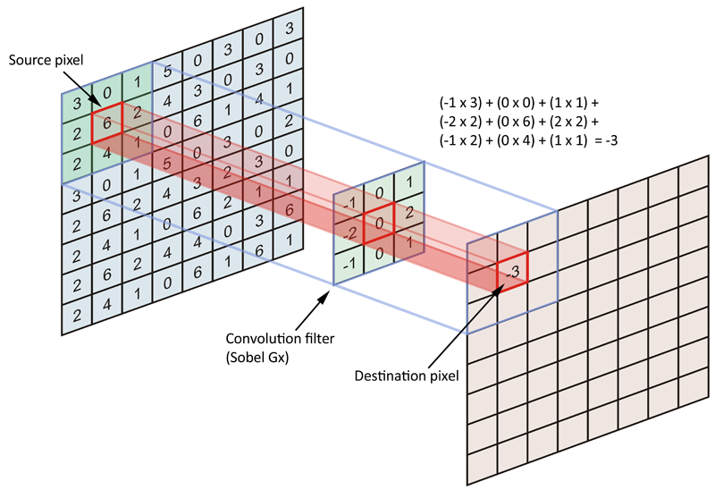

# openCV-practice
Practing the fundamentals of the openCV - Open Source Computer Vision Library using the python programming langauge

**Important:** 
- Download and install openCV using the following command: `$  sudo apt-get install python3-opencv`

- Download and install virtualenv using the following command: `$ sudo apt-get install python3-venv`

- Create virtualenv using the following command: `$ python3 -m venv "name_of_folder"` 

- Activate virtualenv using the following command: `$ source bin/activate`

- Deactivate virtualenv using the following command: `$ deactivate`

- Add files in the virtualvenv by creating a folder name and place the files there

# Notes: 

## What is open CV
- openCV is an open source programming library with real-time computer vision capabilities

- BSD License: Berkely source distribution License, free for both academic and commercial use

## Modules of OpenCV
1. `Core` Module - Used for basic core functions, data structures, functionality to other modules. 
2. `Imgproc` Module - Used for image processing, colour spaces, geometrical transforms, histograms, image filtering.
3. `dnn` Module - Used for deep learning and neural network construction.
4. `ML` Module - Used for machine learning tasks. Regression, classification and clustering algorithms.
5. `Videos` Module - Used for video analysis including background subtraction   , motion estimation and object-tracking algorithms.
6. `HighGui` Module - Used for high-level UI module. Create and manipulate windows that can display images. Add trackbars to the windows, keyboard commands and handle mouse clicks. 
7. `features2D` Module - Used for 2D features framework. This module includes feature detectors, descriptors and descriptor matchers. 
8. `flann` Module - Used for fast library for approximate nearest neighbors. Collection of algorithms that are highly suited for fast nearest neighbors searching.
9. `stiching` Module - Used for implementing stitching pipeline that performs automatic panaromic image stitching. 
10. `shape` Module - Used for shape distance and matching, can be used for shape matching, retrieval or comparison.
11. `superres` Module - contains a set of classes and methofs that cna be used for resolution enhancement. 
12. `videostab` Module - used for stabalisation of video.
13. `viz` Module - used for 3D visualization. Display widgets that provide several methods to interact with  scenes and widgets. 
14. `ImgCodecs` Module - used for image file reading and writing.
15. `object` Module - Used for detection of objects and instances of objects predefined classes for example - face detection, eye detection, and people detection. 
16. `calib3D` Module - used for camera calibration and 3D reconstruction. Covers basic multiple-view geometry algorithms, stereo correspondence algorithms, object pose estimation, and 3D reconstruction.

## Understanding applications and the libraries

* Feature matching
The various points of interest in an image are described as features. The descriptor is used to contain information about these keypoints. 
Eg - Object Detection

* Image Stiching
Creating panaromic image. It is mostly done using feature matching to get params for matching. 

* 3D Image Stiching
Same as panaromic stiching but with a third aspect included. 

* Egomotion estimation
Understanding in which direction the camera was moving while capturing the frames. It is done by 2D frames. 

* Medical Images analysis
Analysis images using CT scan, etc to find saliency map to find interesting regions of interest.

* HCI and BCI 
Human computer interaction - blinking to stop video 

* Stereo Vision
Finding the depth of an image

* Image segmentation and recognition
Understanding if an animal is dog or something else. Finding different objects in an iamge

* Motion tracking using frame differencing
Tracking in which direction a thief went as it is not possible to catch from a naked eye. 

## Libraries used
1. To work with images - NumPy, OpenCV, scikit-image, PIL Pillow
2. To work with text - NLTK, spaCy, NumPy, scikit-learn, Pytorch
3. To work with audio - LibROSA
4. To solve machine learning tasks - pandas, scikit-learn, Orange, Pybrain
5. To see data clearly - Matplotlib, Seaborn, scikit-learn, Orange
6. To use deep learning - Tensorflow, Pytorch, Theano, Keras
7. To do scientifc computing - SciPy
8. To integrate web applications - Django, Flask

**Note:** Why NumPy is faster is than python? 
- Because it provides strong support for multi dimensional array operations 
- 5-100 times faster than Python because it is a collection of similar data-types that are densely packed in memory. 
- Divides task into multiple sub-tasks
- Written in C

## Image basics

### What is an image? 
A 2D representation of a 3D world - Wrong definition. 

A 2D array: X - no of rows, Y - no of columns

A simple image is a 2D function, f(x, y) where (x, y) are the spatial coordinates and the values of f at any point (x, y) is proportional to the brightness or gray levels of the image

$x \in [0, h-1]$
$y \in [0, w-1]$

$f(x, y) \in [0, l-1]$, where l = 256 (for an 8-bit image) 

### Why only 256 values? 
1 bit = 2 values (0, 1)
N bits = 2**N values

Image = 8 bit (1 byte) hence, values = 2**8 = 256

### Difference between image and digital image? 
The value of f(x, y) will always be a discrete value in digital images. Therefore whenever we say image we mean digital image. 

### RGB model
Red - rgb(255, 0, 0)
Green - rgb(0, 255, 0)
Blue - rgb(0, 0, 255)

Black - rgb(0, 0, 0)
White - rgb(255, 255, 255)

### What is color depth?
No of bits used to indicate the color of a single image
Total depth = 3*8 = 24 bits

## Drawing on an image

Every image has 3 channels as discussed above. We can draw a line, a rectangle, a circle, an arrowed line, etc 

Every function has the following parameters:
1. Image - to be drawn on
2. Points - to de drawn from p1(x1, y1) to p2(x2, y2)
3. Color - triplet of values (0-255, 0-255, 0-255)
4. Thickness - how thick the line should be
5. Line type - There are normally 3 line types in openCV. Quadrapal, Octapal and AA line. 

**Concept:** Aliasing and Anti-aliasing 

Aliasing is the visual stair-stepping of edges that occurs in an image when the resolution is too low. Anti-aliasing is the smoothing of jagged edges in digital images by averaging the colors of the pixels at a boundary.

When are there are no transparent pixels, we call such a line as a aliased line 

Line_4 and Line_8 are non anti-aliased lines, whereas Line_AA is anti-aliased line. 

Line_4 and Line_8 are drawn by - bresenham algorithm
Line_AA is drawn by - Gaussian filtering algorithm

## Rotation, Translation and scaling

Optical Zoom - Means moving the zoom lens so that it increases the magnification of light before it even reaches the digital sensor.

Digital Zoom - Not really a zoom, it is simply interpolating the image after it has been acquired at the sensor (pixilation process)

### Scaling 
Refers to the changing the size, i.e increasing or decreasing the pixels in digital image. 

Mathematically, it means - resampling the image and then assigning the new gray values to the resampled position. 

### Interpolation
Process of estimating the values of a continuous function f(x, y)

Formula is as follows: 

#### Types of interpolation 
1. Linear interpolation
2. Area interpolation
3. Cubic interpolation
4. Nearest Neighbor interpolation
5. Sinusoidal interpolation

### Translation
Shift an image in coordinate space by adding a specified value to the x-coordinate and y-coordinate

#### Image translation
- Translation matrix (M)
- Apply M to the image 

$$
\left(\begin{array}{cc} 
1 & 0 & tx\\
0 & 1 & ty\\
\end{array}\right)
$$

tx = translation along the x-axis

ty = translation along the y-axis

To apply the translation matrix we use the `cv2.warpAffine` function. 

**Note:** Whenever we use `cv2.warpAffine` we need to make sure that the translation matrix is of `2 rows` and `3 columns`

## Transforms
1. Euclidean transformation
2. Affine transformation
3. Projective transformation

### What is transformation?
1. Modify spatial relationship between pixels
2. Image can be shifted, rotated, and stretched in multiple ways

### What is Euclidean or isometric transformation? 
In mathematics, a rigid transformation (also called Euclidean transformation or Euclidean isometry) is a geometric transformation of a Euclidean space that preserves the Euclidean distance between every pair of points.

Characteristics: 
- Distance remains preserved
- Angles remains preserved
- Shapes remains preserved

### What is affine transformation? 
It has 6 degrees of freedom - two for translation, one for rotation and one for scaling, one for scaling direction and one for scaling ratio. 

The matrix can be rotated, scaled, translated, sheared

Parralel lines preserved but may be sheared. i.e squares may become parallelogram

## Convolution and Filtering
- Understanding Convolution 
- Low pass and high pass filters
- Blurring using normalized filters
- Motion Blurring

### What is convolution? 
Convolution is a fundamental operation in image processing. 

We basically apply a mathematical operation to each pixel and change its value in some way. 

To apply this mathematical operation, we use another matrix called as kernel. 

#### Why are kernel dimensions always odd? 
Because, the intent of convolution is to encode source data matrix (entire image) in terms of a filter or kernel. More specifically, we are trying to encode the pixels in the neighborhood of anchor/source pixels.

**Note:** The kernel is called as the "**image filter**" and the process of applying this kernel to the image is called as "**image filtering**". The output obtained after applying the kernel to the image is called the "**filtered image**" 

### Low Pass Filter
Is the type of frequency domain filter that attenuates the high frequency components and preserves the low frequency components.
Cutting out high frequency components and allowing low frequency components. 

Characteristics: 
- Used for smoothing the image
- Used for blurring the image
- Removal of aliasing effect
- allows the frequency below cut off frequency to pass through it

### High Pass Filter
Is the type of frequency domain filter that attenuates the low frequency components and preserves the high frequency components.
Cutting out low frequency components and allowing high frequency components. 

Characteristics: 
- Used for sharpening the image
- Used for edge detection
- Removal of noise 
- allows the frequency above cut off frequency to pass through it

### Application of filters
The following function can be used - `cv2.filter2D(src, ddepth, kernel, anchor, border_type)`

**Remember normalising filters before applying to image for stable results. **

### What is edge detection? 
The process of edge detection involves detecting the sharp edges (edges where intensity changes) in the image and producing a binary image as an output. 

Typically we draw white lines on a black background to indicate those edges. 

**Note:** A high change in gradient indicates a major change in the image intensities (edges)

### Types of edge detection
1. Sobel Edge filters (Sobel x and Sobel y)
2. Scharr edge filters 
3. Laplacian filters

#### Sobel Edge Filter
Computes an approximation of the gradient of an image intensity function. 

It is dependent on first order derivatives

Demerits: 
1. Signal to noise ratio
2. Not accurate results and discontinuity 

#### Scharr Edge Filter
This operator is believed to be better than Sobel

This operator is dependent on first order derivatives

#### Laplacian Filter
This operator is also a derivative operator which is used to find edge in an image. 

The major difference between this operator and the others is that this is a second order derivative mask. 

